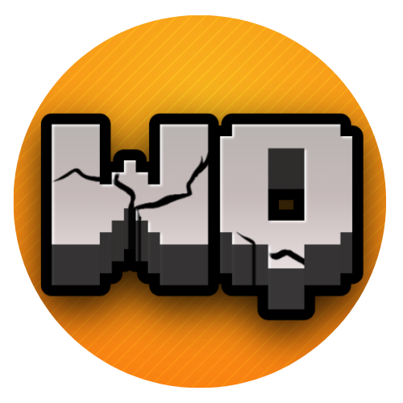

<table style="border-collapse: collapse;">
  <tr>
    <td style="border: none; vertical-align: middle;">
      
    </td>
    <td style="border: none; vertical-align: middle; padding-left: 15px;">
      Wonder Quest
    </td>
  </tr>
</table>

---

## 🌍 Présentation

**Wonder Quest** est un serveur Minecraft moddé unique qui propose une expérience immersive mêlant exploration, survie, chasse, RPG et communauté active.

Accompagné d’un site web moderne et intuitif, Wonder Quest vous plonge dans un univers riche et dynamique, accessible à tous les passionnés de Minecraft.

---

## 🎯 Objectifs du projet

- Offrir un monde vaste et réaliste avec des saisons dynamiques.
- Proposer un gameplay riche avec système de chasse, trophées, compétences RPG.
- Assurer une expérience sécurisée grâce à des plugins de protection.
- Permettre une compatibilité complète entre Minecraft Java et Bedrock.
- Maintenir une communauté active et soudée autour du serveur.

---

## 🌟 Fonctionnalités clés

- **Mods soigneusement sélectionnés** pour l’immersion : TerraForged, Biomes O’ Plenty, Serene Seasons, etc.
- **Plugins robustes** pour la sécurité et la gestion : GriefDefender, LuckPerms, EssentialsX.
- **Compatibilité Java/Bedrock** via GeyserMC et Floodgate.
- **Site web** pour suivre les actualités, mods, plugins et rejoindre la communauté.

---

## 📢 Rejoignez-nous !

- Serveur Minecraft : Bientôt
- Discord officiel : [Rejoindre le Discord](https://discord.gg/ZdYqBsgaNB)
- Site web : [Visitez le site officiel](https://as4mc.github.io/WonderQuest)

---

## 🎥 Captures & médias

  

---

## ⚖️ Droits & Propriété

Ce dépôt présente le projet **Wonder Quest**. Le code source du serveur n’est pas et ne sera pas public.

Tous droits réservés © 2025 Wonder Quest.

---

Merci de votre visite, et à bientôt sur **Wonder Quest** !
